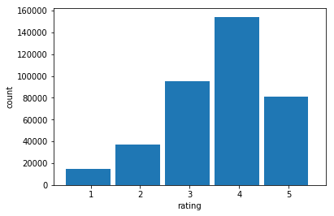

```python
import pandas as pd
import numpy as np
import os

filename = 'yelp_review.csv'
filepath = os.path.join('~','homework','yelp-dataset',filename)
reviews_data_df = pd.read_csv(filepath)
filename = 'restaurants.csv'
filepath = os.path.join(filename)
restaurant_data_df = pd.read_csv(filepath)
restaurant_data_df.rename(columns={'stars':'overall_stars'},inplace=True)
business_and_review = restaurant_data_df.merge(reviews_data_df,on='business_id')

review_df_with_count = business_and_review[
    ['name','review_id','user_id','business_id','stars','text','date']\
    ].merge(business_and_review[['user_id','stars']]\
            .rename(columns={'stars':'review_count'})\
            .groupby('user_id')\
            .count(),left_on = 'user_id',right_index=True)
```


```python
# export for clea
for i in range(4):
    review_df_with_count.iloc[int(i*1e6):int((i+1)*1e6)].to_excel(f'restaurant_review_{i}.xlsx',index=False)
```


```python
review_df_with_count[review_df_with_count['review_count']>1]['review_id'].nunique()
```


    3118350


```python
review_df_with_count[review_df_with_count['review_count']>=30]['review_id'].nunique()
```


    1008461


```python
review_df_with_count[review_df_with_count['review_count']>=50]['review_id'].nunique()
```


    724105


```python
review_df_with_count[review_df_with_count['review_count']>=100]['review_id'].nunique()
```


    395345


```python
import matplotlib.pyplot as plt
thresholds = [0,1,30,50,100,1000]
for n in range(len(thresholds)-1):
    upper = thresholds[n+1]
    lower = thresholds[n]
    print(f'rating distribution of reviews from users with {lower} to {upper} reviews written')
#     upper_filter = review_df_with_count['review_count']>lower
#     lower_filter = review_df_with_count['review_count']<=upper
    reviews = list(review_df_with_count[
        (review_df_with_count['review_count']>lower) & \
        (review_df_with_count['review_count']<=upper)]['stars'])
    print(f'{len(reviews)} reviews in subset')
    plt.hist(reviews,bins=[x+0.5 for x in range(6)],align='mid',width=0.9)
    plt.xlabel('rating')
    plt.ylabel('count')
    plt.show()
```

    rating distribution of reviews from users with 0 to 1 reviews written
    518291 reviews in subset


    rating distribution of reviews from users with 1 to 30 reviews written
    2129629 reviews in subset


    rating distribution of reviews from users with 30 to 50 reviews written
    274066 reviews in subset


    rating distribution of reviews from users with 50 to 100 reviews written
    323310 reviews in subset


    rating distribution of reviews from users with 100 to 1000 reviews written
    382571 reviews in subset





```python
upper_filter = review_df_with_count['review_count']>lower
lower_filter = review_df_with_count['review_count']<=upper
    
```


```python
upper = 100
lower = 50
reviews_50_100 = review_df_with_count[
        (review_df_with_count['review_count']>lower) & \
        (review_df_with_count['review_count']<=upper)]
reviews_50_100.to_excel('reviews_users_50-100.xlsx',index = False)
```
