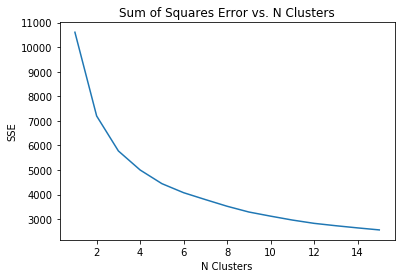
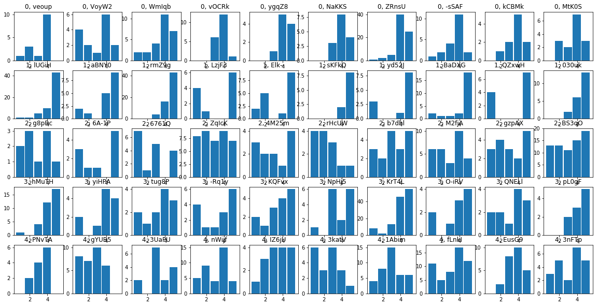

```python
# Dependencies
import pandas as pd
import numpy as np
import matplotlib.pyplot as plt
import os
from sklearn.cluster import KMeans
```


```python
# Use this Dataframe to narrow down users who have written reviews for restaurants
filename = 'yelp_review.csv'
filepath = os.path.join('~','homework','yelp-dataset',filename)
reviews_data_df = pd.read_csv(filepath)
filename = 'restaurants.csv'
filepath = os.path.join(filename)
restaurant_data_df = pd.read_csv(filepath)
restaurant_data_df.rename(columns={'stars':'overall_stars'},inplace=True)
business_and_review = restaurant_data_df.merge(reviews_data_df,on='business_id')
business_and_review.head()
```


<div>
<style scoped>
    .dataframe tbody tr th:only-of-type {
        vertical-align: middle;
    }

    .dataframe tbody tr th {
        vertical-align: top;
    }

    .dataframe thead th {
        text-align: right;
    }
</style>
<table border="1" class="dataframe">
  <thead>
    <tr style="text-align: right;">
      <th></th>
      <th>business_id</th>
      <th>name</th>
      <th>neighborhood</th>
      <th>address</th>
      <th>city</th>
      <th>state</th>
      <th>postal_code</th>
      <th>latitude</th>
      <th>longitude</th>
      <th>overall_stars</th>
      <th>...</th>
      <th>is_open</th>
      <th>categories</th>
      <th>review_id</th>
      <th>user_id</th>
      <th>stars</th>
      <th>date</th>
      <th>text</th>
      <th>useful</th>
      <th>funny</th>
      <th>cool</th>
    </tr>
  </thead>
  <tbody>
    <tr>
      <th>0</th>
      <td>PfOCPjBrlQAnz__NXj9h_w</td>
      <td>"Brick House Tavern + Tap"</td>
      <td>NaN</td>
      <td>"581 Howe Ave"</td>
      <td>Cuyahoga Falls</td>
      <td>OH</td>
      <td>44221</td>
      <td>41.119535</td>
      <td>-81.47569</td>
      <td>3.5</td>
      <td>...</td>
      <td>1</td>
      <td>American (New);Nightlife;Bars;Sandwiches;Ameri...</td>
      <td>rnvu74aNIPn93Z9Ue11Epw</td>
      <td>bgtr7jOlALe8ay4g7pnf4A</td>
      <td>4</td>
      <td>2016-05-05</td>
      <td>I've always enjoyed my time at brick house foo...</td>
      <td>0</td>
      <td>0</td>
      <td>0</td>
    </tr>
    <tr>
      <th>1</th>
      <td>PfOCPjBrlQAnz__NXj9h_w</td>
      <td>"Brick House Tavern + Tap"</td>
      <td>NaN</td>
      <td>"581 Howe Ave"</td>
      <td>Cuyahoga Falls</td>
      <td>OH</td>
      <td>44221</td>
      <td>41.119535</td>
      <td>-81.47569</td>
      <td>3.5</td>
      <td>...</td>
      <td>1</td>
      <td>American (New);Nightlife;Bars;Sandwiches;Ameri...</td>
      <td>OE5dH664oSSK_-TvIl263w</td>
      <td>ndZOHkG_FWdL4TRd9xRfNQ</td>
      <td>2</td>
      <td>2017-03-19</td>
      <td>1st time here. Came w my Unc bc Louies was clo...</td>
      <td>0</td>
      <td>0</td>
      <td>0</td>
    </tr>
    <tr>
      <th>2</th>
      <td>PfOCPjBrlQAnz__NXj9h_w</td>
      <td>"Brick House Tavern + Tap"</td>
      <td>NaN</td>
      <td>"581 Howe Ave"</td>
      <td>Cuyahoga Falls</td>
      <td>OH</td>
      <td>44221</td>
      <td>41.119535</td>
      <td>-81.47569</td>
      <td>3.5</td>
      <td>...</td>
      <td>1</td>
      <td>American (New);Nightlife;Bars;Sandwiches;Ameri...</td>
      <td>SWeHmo8uHHWbbv94VdAMeQ</td>
      <td>UqtE83J-6NMQNNJzpnWwEQ</td>
      <td>1</td>
      <td>2015-08-31</td>
      <td>Worse service ever andI use to be a server so ...</td>
      <td>0</td>
      <td>0</td>
      <td>0</td>
    </tr>
    <tr>
      <th>3</th>
      <td>PfOCPjBrlQAnz__NXj9h_w</td>
      <td>"Brick House Tavern + Tap"</td>
      <td>NaN</td>
      <td>"581 Howe Ave"</td>
      <td>Cuyahoga Falls</td>
      <td>OH</td>
      <td>44221</td>
      <td>41.119535</td>
      <td>-81.47569</td>
      <td>3.5</td>
      <td>...</td>
      <td>1</td>
      <td>American (New);Nightlife;Bars;Sandwiches;Ameri...</td>
      <td>fCCL0pAgYGccUs8shHHIUA</td>
      <td>PixAmdRa58XZ3hr8YLS36g</td>
      <td>5</td>
      <td>2015-10-09</td>
      <td>I am updating my review to 5-stars because I t...</td>
      <td>2</td>
      <td>0</td>
      <td>2</td>
    </tr>
    <tr>
      <th>4</th>
      <td>PfOCPjBrlQAnz__NXj9h_w</td>
      <td>"Brick House Tavern + Tap"</td>
      <td>NaN</td>
      <td>"581 Howe Ave"</td>
      <td>Cuyahoga Falls</td>
      <td>OH</td>
      <td>44221</td>
      <td>41.119535</td>
      <td>-81.47569</td>
      <td>3.5</td>
      <td>...</td>
      <td>1</td>
      <td>American (New);Nightlife;Bars;Sandwiches;Ameri...</td>
      <td>-VOh0NNnIo1r24hjwSZL4Q</td>
      <td>Hly0NEWXMxbuXa2zm_NJOQ</td>
      <td>4</td>
      <td>2015-01-15</td>
      <td>I enjoyed this place.  I went the night the Bu...</td>
      <td>0</td>
      <td>0</td>
      <td>0</td>
    </tr>
  </tbody>
</table>
<p>5 rows × 21 columns</p>
</div>


```python
# Rating distributions normalized by total reviews written
filename= 'restaurant_reviewers_pct.xlsx'
filepath = os.path.join(filename)
restaurant_reviews_pct = pd.read_excel(filepath,header=1)
restaurant_reviews_pct.fillna(0,inplace=True)
restaurant_reviews_pct.set_index(['User Id'],inplace=True)
restaurant_reviews_pct.head()
```


<div>
<style scoped>
    .dataframe tbody tr th:only-of-type {
        vertical-align: middle;
    }

    .dataframe tbody tr th {
        vertical-align: top;
    }

    .dataframe thead th {
        text-align: right;
    }
</style>
<table border="1" class="dataframe">
  <thead>
    <tr style="text-align: right;">
      <th></th>
      <th>1</th>
      <th>2</th>
      <th>3</th>
      <th>4</th>
      <th>5</th>
    </tr>
    <tr>
      <th>User Id</th>
      <th></th>
      <th></th>
      <th></th>
      <th></th>
      <th></th>
    </tr>
  </thead>
  <tbody>
    <tr>
      <th>0_0-eY7lxC-2DgCATusr-g</th>
      <td>0.0</td>
      <td>1.0</td>
      <td>0.0</td>
      <td>0.0</td>
      <td>0.0</td>
    </tr>
    <tr>
      <th>0_0Lg3MMEi9NAGztLdL52Q</th>
      <td>0.0</td>
      <td>0.0</td>
      <td>0.0</td>
      <td>0.0</td>
      <td>1.0</td>
    </tr>
    <tr>
      <th>0_0r9eJyfLs87vFLaXIsRg</th>
      <td>0.0</td>
      <td>0.0</td>
      <td>0.0</td>
      <td>1.0</td>
      <td>0.0</td>
    </tr>
    <tr>
      <th>0_0u-ggFJhigAwWuvok8Zg</th>
      <td>0.0</td>
      <td>0.0</td>
      <td>0.0</td>
      <td>0.0</td>
      <td>1.0</td>
    </tr>
    <tr>
      <th>0_0YL1uj3Ds_ZFdPt9wx4w</th>
      <td>0.0</td>
      <td>0.0</td>
      <td>0.0</td>
      <td>1.0</td>
      <td>0.0</td>
    </tr>
  </tbody>
</table>
</div>


```python
# Raw counts of Ratings associated with reviews
filename= 'restaurant_reviewers_cnt.xlsx'
filepath = os.path.join(filename)
restaurant_reviews_cnt = pd.read_excel(filepath,header=1)
restaurant_reviews_cnt.fillna(0,inplace=True)
restaurant_reviews_cnt.set_index(['User Id'],inplace=True)
restaurant_reviews_cnt.head()
```


<div>
<style scoped>
    .dataframe tbody tr th:only-of-type {
        vertical-align: middle;
    }

    .dataframe tbody tr th {
        vertical-align: top;
    }

    .dataframe thead th {
        text-align: right;
    }
</style>
<table border="1" class="dataframe">
  <thead>
    <tr style="text-align: right;">
      <th></th>
      <th>1</th>
      <th>2</th>
      <th>3</th>
      <th>4</th>
      <th>5</th>
    </tr>
    <tr>
      <th>User Id</th>
      <th></th>
      <th></th>
      <th></th>
      <th></th>
      <th></th>
    </tr>
  </thead>
  <tbody>
    <tr>
      <th>0_0-eY7lxC-2DgCATusr-g</th>
      <td>0.0</td>
      <td>1.0</td>
      <td>0.0</td>
      <td>0.0</td>
      <td>0.0</td>
    </tr>
    <tr>
      <th>0_0Lg3MMEi9NAGztLdL52Q</th>
      <td>0.0</td>
      <td>0.0</td>
      <td>0.0</td>
      <td>0.0</td>
      <td>1.0</td>
    </tr>
    <tr>
      <th>0_0r9eJyfLs87vFLaXIsRg</th>
      <td>0.0</td>
      <td>0.0</td>
      <td>0.0</td>
      <td>1.0</td>
      <td>0.0</td>
    </tr>
    <tr>
      <th>0_0u-ggFJhigAwWuvok8Zg</th>
      <td>0.0</td>
      <td>0.0</td>
      <td>0.0</td>
      <td>0.0</td>
      <td>1.0</td>
    </tr>
    <tr>
      <th>0_0YL1uj3Ds_ZFdPt9wx4w</th>
      <td>0.0</td>
      <td>0.0</td>
      <td>0.0</td>
      <td>1.0</td>
      <td>0.0</td>
    </tr>
  </tbody>
</table>
</div>


```python
# Statistical metrics of rating distributions
filename = 'rating_description_per_user_alt.csv'
filepath = os.path.join(filename)
rating_desc = pd.read_csv(filepath)
rating_desc.drop('mode',axis=1,inplace=True)
rating_desc.fillna(0,inplace=True)
rating_desc.set_index('user_id',inplace=True)
rating_desc.head()
```


<div>
<style scoped>
    .dataframe tbody tr th:only-of-type {
        vertical-align: middle;
    }

    .dataframe tbody tr th {
        vertical-align: top;
    }

    .dataframe thead th {
        text-align: right;
    }
</style>
<table border="1" class="dataframe">
  <thead>
    <tr style="text-align: right;">
      <th></th>
      <th>10th_quantile</th>
      <th>25th_quantile</th>
      <th>75th_quantile</th>
      <th>90th_quantile</th>
      <th>max</th>
      <th>mean_avg</th>
      <th>med</th>
      <th>min</th>
      <th>review_count</th>
      <th>std</th>
      <th>var</th>
    </tr>
    <tr>
      <th>user_id</th>
      <th></th>
      <th></th>
      <th></th>
      <th></th>
      <th></th>
      <th></th>
      <th></th>
      <th></th>
      <th></th>
      <th></th>
      <th></th>
    </tr>
  </thead>
  <tbody>
    <tr>
      <th>---1lKK3aKOuomHnwAkAow</th>
      <td>1.0</td>
      <td>3.00</td>
      <td>5.00</td>
      <td>5.0</td>
      <td>5</td>
      <td>3.861111</td>
      <td>4.5</td>
      <td>1</td>
      <td>72</td>
      <td>1.466101</td>
      <td>2.149452</td>
    </tr>
    <tr>
      <th>---PLwSf5gKdIoVnyRHgBA</th>
      <td>3.0</td>
      <td>3.00</td>
      <td>3.00</td>
      <td>3.0</td>
      <td>3</td>
      <td>3.000000</td>
      <td>3.0</td>
      <td>3</td>
      <td>1</td>
      <td>0.000000</td>
      <td>0.000000</td>
    </tr>
    <tr>
      <th>---cu1hq55BP9DWVXXKHZg</th>
      <td>1.3</td>
      <td>1.75</td>
      <td>3.25</td>
      <td>3.7</td>
      <td>4</td>
      <td>2.500000</td>
      <td>2.5</td>
      <td>1</td>
      <td>2</td>
      <td>2.121320</td>
      <td>4.500000</td>
    </tr>
    <tr>
      <th>---udAKDsn0yQXmzbWQNSw</th>
      <td>4.1</td>
      <td>4.25</td>
      <td>4.75</td>
      <td>4.9</td>
      <td>5</td>
      <td>4.500000</td>
      <td>4.5</td>
      <td>4</td>
      <td>2</td>
      <td>0.707107</td>
      <td>0.500000</td>
    </tr>
    <tr>
      <th>--0RtXvcOIE4XbErYca6Rw</th>
      <td>4.0</td>
      <td>4.00</td>
      <td>4.00</td>
      <td>4.0</td>
      <td>4</td>
      <td>4.000000</td>
      <td>4.0</td>
      <td>4</td>
      <td>1</td>
      <td>0.000000</td>
      <td>0.000000</td>
    </tr>
  </tbody>
</table>
</div>


```python
# Create Derived descriptors DataFrame
temp_1 = restaurant_reviews_pct.merge(rating_desc,left_index=True,right_index=True)
def round_star(metric):
    return int(np.round(metric))
# min to med slope
def min_med(x):
    med_star = int(np.floor(x['med']))
    min_star = int(np.round(x['min']))
    rise = x[str(med_star)] - x[str(min_star)]
    run = med_star - min_star
    if run == 0:
        return 0
    else:
        return rise/run
temp_1['min_med_slope'] = temp_1.apply(min_med,axis=1)
# med to max slope
def med_max(x):
    med_star = int(np.ceil(x['med']))
    max_star = int(np.round(x['max']))
    rise =  x[str(max_star)] - x[str(med_star)]
    run = max_star - med_star
    if run == 0:
        return 0
    else:
        return rise/run
temp_1['med_max_slope'] = temp_1.apply(med_max,axis=1)
temp_1['mean-med'] = temp_1.apply(lambda x: np.round(x['mean_avg']*2)/2-x['med'],axis=1)
temp_1['inflection'] = temp_1.apply(lambda x: x['min_med_slope']*x['med_max_slope'],axis=1)
derived = temp_1[['mean-med','min_med_slope','med_max_slope','inflection']]
derived.head()
```


<div>
<style scoped>
    .dataframe tbody tr th:only-of-type {
        vertical-align: middle;
    }

    .dataframe tbody tr th {
        vertical-align: top;
    }

    .dataframe thead th {
        text-align: right;
    }
</style>
<table border="1" class="dataframe">
  <thead>
    <tr style="text-align: right;">
      <th></th>
      <th>mean-med</th>
      <th>min_med_slope</th>
      <th>med_max_slope</th>
      <th>inflection</th>
    </tr>
  </thead>
  <tbody>
    <tr>
      <th>0_0-eY7lxC-2DgCATusr-g</th>
      <td>0.0</td>
      <td>0.0</td>
      <td>0.0</td>
      <td>0.0</td>
    </tr>
    <tr>
      <th>0_0Lg3MMEi9NAGztLdL52Q</th>
      <td>0.0</td>
      <td>0.0</td>
      <td>0.0</td>
      <td>0.0</td>
    </tr>
    <tr>
      <th>0_0r9eJyfLs87vFLaXIsRg</th>
      <td>0.0</td>
      <td>0.0</td>
      <td>0.0</td>
      <td>0.0</td>
    </tr>
    <tr>
      <th>0_0u-ggFJhigAwWuvok8Zg</th>
      <td>0.0</td>
      <td>0.0</td>
      <td>0.0</td>
      <td>0.0</td>
    </tr>
    <tr>
      <th>0_0YL1uj3Ds_ZFdPt9wx4w</th>
      <td>0.0</td>
      <td>0.0</td>
      <td>0.0</td>
      <td>0.0</td>
    </tr>
  </tbody>
</table>
</div>


```python
def plot_dist(user,show=True):
    data = business_and_review.loc[business_and_review['user_id'] == user]['stars']
    plt.hist(list(data),bins=[x+0.5 for x in range(6)],align='mid',width=0.9)
    plt.title(user)
    if show:
        plt.show()
```


```python
def normalize(input_list):
    if (np.min(input_list) == 0) & (np.max(input_list)==1):
        return input_list
    else:
        ref = np.max(input_list) - np.min(input_list)
        return (input_list - np.min(input_list))/ref
```


```python
restaurant_reviews_cnt.index.nunique()
```


    960561


```python
# source = restaurant_reviews_cnt
# source = restaurant_reviews_pct
# source = rating_desc
# source = restaurant_reviews.merge(rating_desc,left_index=True,right_index=True)
# source = restaurant_reviews_pct.merge(
#     restaurant_reviews_cnt,left_index=True,right_index=True).merge(
#     rating_desc[[
#         'review_count','10th_quantile','90th_quantile','mean_avg','var','med'
#     ]],left_index=True,right_index=True)
source = restaurant_reviews_pct.merge(
    rating_desc[[
        'review_count'
    ]],left_index=True,right_index=True).merge(derived,left_index=True,right_index=True)
# source = derived
source.index.nunique()
```


    960560


```python
# Other Filtering Steps
```


```python
if True:
    # Remove low-count reviewers 
    source = source[source['review_count'] >= 10]
source.index.nunique()
```


    64986


```python
if False:
    # Separate Single-Rating reviewers (reviewers who predominantly give out the same rating)
    monotony_threshold = 0.8
    # source = source[source.apply(lambda x: x[['1_x','2_x','3_x','4_x','5_x']].max() < monotony_threshold,axis=1)]
    source = source[source.apply(lambda x: x[['1','2','3','4','5']].max() < monotony_threshold,axis=1)]
source.index.nunique()
```


```python
source.apply(normalize,axis=0).head()
```


<div>
<style scoped>
    .dataframe tbody tr th:only-of-type {
        vertical-align: middle;
    }

    .dataframe tbody tr th {
        vertical-align: top;
    }

    .dataframe thead th {
        text-align: right;
    }
</style>
<table border="1" class="dataframe">
  <thead>
    <tr style="text-align: right;">
      <th></th>
      <th>1</th>
      <th>2</th>
      <th>3</th>
      <th>4</th>
      <th>5</th>
      <th>review_count</th>
      <th>mean-med</th>
      <th>min_med_slope</th>
      <th>med_max_slope</th>
      <th>inflection</th>
    </tr>
  </thead>
  <tbody>
    <tr>
      <th>0_6zmGnyHQrls5sJdKqudQ</th>
      <td>0.000000</td>
      <td>0.000000</td>
      <td>0.295455</td>
      <td>0.090909</td>
      <td>0.636364</td>
      <td>0.000337</td>
      <td>0.375</td>
      <td>0.466999</td>
      <td>0.640000</td>
      <td>0.838762</td>
    </tr>
    <tr>
      <th>0_9HCOdSBSrgeboN_pDcgA</th>
      <td>0.105263</td>
      <td>0.000000</td>
      <td>0.057018</td>
      <td>0.210526</td>
      <td>0.631579</td>
      <td>0.003034</td>
      <td>0.375</td>
      <td>0.432588</td>
      <td>0.640000</td>
      <td>0.838762</td>
    </tr>
    <tr>
      <th>0_71XZqxNetnJjJIINQCOg</th>
      <td>0.000000</td>
      <td>0.227273</td>
      <td>0.196970</td>
      <td>0.272727</td>
      <td>0.363636</td>
      <td>0.000337</td>
      <td>0.500</td>
      <td>0.373599</td>
      <td>0.705455</td>
      <td>0.843559</td>
    </tr>
    <tr>
      <th>0_aerl3cE66GEmqiAh9_aA</th>
      <td>0.000000</td>
      <td>0.125000</td>
      <td>0.000000</td>
      <td>0.100000</td>
      <td>0.800000</td>
      <td>0.000000</td>
      <td>0.375</td>
      <td>0.502283</td>
      <td>0.640000</td>
      <td>0.838762</td>
    </tr>
    <tr>
      <th>0_Cfb4ZEG2mQY9C2ACHnbA</th>
      <td>0.062500</td>
      <td>0.195312</td>
      <td>0.270833</td>
      <td>0.343750</td>
      <td>0.187500</td>
      <td>0.007417</td>
      <td>0.375</td>
      <td>0.406678</td>
      <td>0.527500</td>
      <td>0.821756</td>
    </tr>
  </tbody>
</table>
</div>


```python
data = source.apply(normalize,axis=0).values.tolist()
```


```python
# graphically show Sum of Squares Error
sse = []
try_k = 15
for k in range(1, try_k+1):
#     print(f"k = {k}")
    kmeans = KMeans(n_clusters=k)
    kmeans.fit(data)
    sse.append(kmeans.inertia_)

plt.plot(range(1, try_k+1), sse)
plt.title('Sum of Squares Error vs. N Clusters')
plt.xlabel('N Clusters')
plt.ylabel('SSE')
plt.show()
```





```python
# Automate selection of N Clusters
select_threshold = 10
gain = []
for i in range(1,try_k):
    this_gain = 100*(sse[i-1]-sse[i])/sse[i-1]
    gain.append(this_gain)
    if this_gain <= select_threshold:
        print(f'select k = {i}')
        n_clusters = i
        break
```

    select k = 5


```python
kmeans = KMeans(n_clusters=n_clusters)
# kmeans = KMeans(n_clusters=6)
kmeans.fit(data)

# Predict the clusters
predicted_clusters = kmeans.predict(data)

prediction = []
for i,user in enumerate(source.index):
    prediction.append(predicted_clusters[i])
k_means_output = pd.DataFrame({'user_id':list(source.index),
             'prediction':prediction})

output_context = source.merge(k_means_output,left_index=True,right_on='user_id')
output_context.groupby('prediction')['user_id'].count()
```


    prediction
    0    12666
    1    13619
    2     6542
    3    18843
    4    13316
    Name: user_id, dtype: int64


```python
# Spot check predictions
sample = 10
plt.figure(figsize = [20,10])
counter = 1
# for i in range(6):
for i in range(n_clusters):
    sample_users = np.random.choice(output_context[output_context['prediction']==i]['user_id'],sample)
    for j,this_user in enumerate(sample_users):
        plt.subplot(n_clusters,sample,counter)
#         this_user = np.random.choice(output_context[output_context['prediction']==i]['user_id'],1)[0]
        plot_dist(this_user,show=False)
        plt.title(f'{i}, {this_user[:5]}')
        counter+=1
plt.show()
```





```python
output_context.groupby('prediction').head().sort_values('prediction')
```


<div>
<style scoped>
    .dataframe tbody tr th:only-of-type {
        vertical-align: middle;
    }

    .dataframe tbody tr th {
        vertical-align: top;
    }

    .dataframe thead th {
        text-align: right;
    }
</style>
<table border="1" class="dataframe">
  <thead>
    <tr style="text-align: right;">
      <th></th>
      <th>1</th>
      <th>2</th>
      <th>3</th>
      <th>4</th>
      <th>5</th>
      <th>review_count</th>
      <th>mean-med</th>
      <th>min_med_slope</th>
      <th>med_max_slope</th>
      <th>inflection</th>
      <th>prediction</th>
      <th>user_id</th>
    </tr>
  </thead>
  <tbody>
    <tr>
      <th>12</th>
      <td>0.000000</td>
      <td>0.052632</td>
      <td>0.105263</td>
      <td>0.526316</td>
      <td>0.315789</td>
      <td>19</td>
      <td>0.0</td>
      <td>0.236842</td>
      <td>-0.210526</td>
      <td>-0.049861</td>
      <td>0</td>
      <td>0_NbnQy2AwOUDtDUr4uDTg</td>
    </tr>
    <tr>
      <th>32</th>
      <td>0.044444</td>
      <td>0.044444</td>
      <td>0.133333</td>
      <td>0.488889</td>
      <td>0.288889</td>
      <td>45</td>
      <td>0.0</td>
      <td>0.148148</td>
      <td>-0.200000</td>
      <td>-0.029630</td>
      <td>0</td>
      <td>0A9i7xt77g1PYS7j219XcQ</td>
    </tr>
    <tr>
      <th>10</th>
      <td>0.037037</td>
      <td>0.148148</td>
      <td>0.111111</td>
      <td>0.592593</td>
      <td>0.111111</td>
      <td>27</td>
      <td>-0.5</td>
      <td>0.185185</td>
      <td>-0.481481</td>
      <td>-0.089163</td>
      <td>0</td>
      <td>0_J-edyZgAkDPHjpZKmiMg</td>
    </tr>
    <tr>
      <th>9</th>
      <td>0.000000</td>
      <td>0.050633</td>
      <td>0.240506</td>
      <td>0.569620</td>
      <td>0.139241</td>
      <td>79</td>
      <td>0.0</td>
      <td>0.259494</td>
      <td>-0.430380</td>
      <td>-0.111681</td>
      <td>0</td>
      <td>0_iROv6FL4KCveV916IpTA</td>
    </tr>
    <tr>
      <th>5</th>
      <td>0.000000</td>
      <td>0.090909</td>
      <td>0.090909</td>
      <td>0.545455</td>
      <td>0.272727</td>
      <td>11</td>
      <td>0.0</td>
      <td>0.227273</td>
      <td>-0.272727</td>
      <td>-0.061983</td>
      <td>0</td>
      <td>0_dLB7aYv_yCRg13g3cs0g</td>
    </tr>
    <tr>
      <th>11</th>
      <td>0.000000</td>
      <td>0.000000</td>
      <td>0.090909</td>
      <td>0.090909</td>
      <td>0.818182</td>
      <td>11</td>
      <td>-0.5</td>
      <td>0.363636</td>
      <td>0.000000</td>
      <td>0.000000</td>
      <td>1</td>
      <td>0_m_fXlRXxGFKUMkVo2nUg</td>
    </tr>
    <tr>
      <th>8</th>
      <td>0.000000</td>
      <td>0.000000</td>
      <td>0.100000</td>
      <td>0.300000</td>
      <td>0.600000</td>
      <td>10</td>
      <td>-0.5</td>
      <td>0.250000</td>
      <td>0.000000</td>
      <td>0.000000</td>
      <td>1</td>
      <td>0_ImqV5kJJC01CBX7uk8cQ</td>
    </tr>
    <tr>
      <th>0</th>
      <td>0.000000</td>
      <td>0.000000</td>
      <td>0.272727</td>
      <td>0.090909</td>
      <td>0.636364</td>
      <td>11</td>
      <td>-0.5</td>
      <td>0.181818</td>
      <td>0.000000</td>
      <td>0.000000</td>
      <td>1</td>
      <td>0_6zmGnyHQrls5sJdKqudQ</td>
    </tr>
    <tr>
      <th>1</th>
      <td>0.105263</td>
      <td>0.000000</td>
      <td>0.052632</td>
      <td>0.210526</td>
      <td>0.631579</td>
      <td>19</td>
      <td>-0.5</td>
      <td>0.131579</td>
      <td>0.000000</td>
      <td>0.000000</td>
      <td>1</td>
      <td>0_9HCOdSBSrgeboN_pDcgA</td>
    </tr>
    <tr>
      <th>3</th>
      <td>0.000000</td>
      <td>0.100000</td>
      <td>0.000000</td>
      <td>0.100000</td>
      <td>0.800000</td>
      <td>10</td>
      <td>-0.5</td>
      <td>0.233333</td>
      <td>0.000000</td>
      <td>0.000000</td>
      <td>1</td>
      <td>0_aerl3cE66GEmqiAh9_aA</td>
    </tr>
    <tr>
      <th>47</th>
      <td>0.400000</td>
      <td>0.100000</td>
      <td>0.000000</td>
      <td>0.000000</td>
      <td>0.500000</td>
      <td>10</td>
      <td>-0.5</td>
      <td>-0.200000</td>
      <td>0.500000</td>
      <td>-0.100000</td>
      <td>2</td>
      <td>0AKk4nxIt0rlbyylj7s73Q</td>
    </tr>
    <tr>
      <th>30</th>
      <td>0.190476</td>
      <td>0.285714</td>
      <td>0.095238</td>
      <td>0.190476</td>
      <td>0.238095</td>
      <td>21</td>
      <td>0.0</td>
      <td>-0.047619</td>
      <td>0.071429</td>
      <td>-0.003401</td>
      <td>2</td>
      <td>0A5Bjqb3dLj6NfsBHzDuXA</td>
    </tr>
    <tr>
      <th>44</th>
      <td>0.333333</td>
      <td>0.047619</td>
      <td>0.142857</td>
      <td>0.190476</td>
      <td>0.285714</td>
      <td>21</td>
      <td>0.0</td>
      <td>-0.095238</td>
      <td>0.071429</td>
      <td>-0.006803</td>
      <td>2</td>
      <td>0aJBU9Jv15xA3MA5HZ0gjg</td>
    </tr>
    <tr>
      <th>26</th>
      <td>0.700000</td>
      <td>0.300000</td>
      <td>0.000000</td>
      <td>0.000000</td>
      <td>0.000000</td>
      <td>10</td>
      <td>0.5</td>
      <td>0.000000</td>
      <td>-0.400000</td>
      <td>-0.000000</td>
      <td>2</td>
      <td>0-Ypt2ywfCYQ_HEfOZ0r4g</td>
    </tr>
    <tr>
      <th>24</th>
      <td>0.083333</td>
      <td>0.333333</td>
      <td>0.166667</td>
      <td>0.208333</td>
      <td>0.208333</td>
      <td>24</td>
      <td>0.0</td>
      <td>0.041667</td>
      <td>0.020833</td>
      <td>0.000868</td>
      <td>2</td>
      <td>0-UxxxWLz1muOzPx2F3-kQ</td>
    </tr>
    <tr>
      <th>7</th>
      <td>0.000000</td>
      <td>0.090909</td>
      <td>0.272727</td>
      <td>0.272727</td>
      <td>0.363636</td>
      <td>11</td>
      <td>0.0</td>
      <td>0.090909</td>
      <td>0.090909</td>
      <td>0.008264</td>
      <td>3</td>
      <td>0_G3Cuk88nBAQ1M03g56lA</td>
    </tr>
    <tr>
      <th>16</th>
      <td>0.090909</td>
      <td>0.000000</td>
      <td>0.181818</td>
      <td>0.363636</td>
      <td>0.363636</td>
      <td>11</td>
      <td>0.0</td>
      <td>0.090909</td>
      <td>0.000000</td>
      <td>0.000000</td>
      <td>3</td>
      <td>0-5GNzaQOJuMJeVgECShEw</td>
    </tr>
    <tr>
      <th>14</th>
      <td>0.000000</td>
      <td>0.214286</td>
      <td>0.214286</td>
      <td>0.214286</td>
      <td>0.357143</td>
      <td>14</td>
      <td>-0.5</td>
      <td>0.000000</td>
      <td>0.142857</td>
      <td>0.000000</td>
      <td>3</td>
      <td>0_nrYU_QKIHQ3zc1w5Rm3w</td>
    </tr>
    <tr>
      <th>13</th>
      <td>0.200000</td>
      <td>0.133333</td>
      <td>0.000000</td>
      <td>0.266667</td>
      <td>0.400000</td>
      <td>15</td>
      <td>-0.5</td>
      <td>0.022222</td>
      <td>0.133333</td>
      <td>0.002963</td>
      <td>3</td>
      <td>0_Nf5WBUb3U1j610Yjbg7A</td>
    </tr>
    <tr>
      <th>2</th>
      <td>0.000000</td>
      <td>0.181818</td>
      <td>0.181818</td>
      <td>0.272727</td>
      <td>0.363636</td>
      <td>11</td>
      <td>0.0</td>
      <td>0.045455</td>
      <td>0.090909</td>
      <td>0.004132</td>
      <td>3</td>
      <td>0_71XZqxNetnJjJIINQCOg</td>
    </tr>
    <tr>
      <th>17</th>
      <td>0.071429</td>
      <td>0.500000</td>
      <td>0.071429</td>
      <td>0.285714</td>
      <td>0.071429</td>
      <td>14</td>
      <td>1.0</td>
      <td>0.428571</td>
      <td>-0.142857</td>
      <td>-0.061224</td>
      <td>4</td>
      <td>0-7mDJd9bOGtmq3FHoZB-Q</td>
    </tr>
    <tr>
      <th>19</th>
      <td>0.000000</td>
      <td>0.100000</td>
      <td>0.200000</td>
      <td>0.400000</td>
      <td>0.300000</td>
      <td>10</td>
      <td>0.0</td>
      <td>0.150000</td>
      <td>-0.100000</td>
      <td>-0.015000</td>
      <td>4</td>
      <td>0-BQfUKMcI0dX_OiaGlJjA</td>
    </tr>
    <tr>
      <th>4</th>
      <td>0.062500</td>
      <td>0.156250</td>
      <td>0.250000</td>
      <td>0.343750</td>
      <td>0.187500</td>
      <td>32</td>
      <td>-0.5</td>
      <td>0.093750</td>
      <td>-0.156250</td>
      <td>-0.014648</td>
      <td>4</td>
      <td>0_Cfb4ZEG2mQY9C2ACHnbA</td>
    </tr>
    <tr>
      <th>15</th>
      <td>0.250000</td>
      <td>0.083333</td>
      <td>0.583333</td>
      <td>0.083333</td>
      <td>0.000000</td>
      <td>12</td>
      <td>-0.5</td>
      <td>0.166667</td>
      <td>-0.500000</td>
      <td>-0.083333</td>
      <td>4</td>
      <td>0_RQdCuZGHAtBIZ5ST8TGw</td>
    </tr>
    <tr>
      <th>6</th>
      <td>0.200000</td>
      <td>0.100000</td>
      <td>0.200000</td>
      <td>0.300000</td>
      <td>0.200000</td>
      <td>10</td>
      <td>-0.5</td>
      <td>0.000000</td>
      <td>-0.100000</td>
      <td>-0.000000</td>
      <td>4</td>
      <td>0_FRTEe0XJnPxS4Nsj5tng</td>
    </tr>
  </tbody>
</table>
</div>


